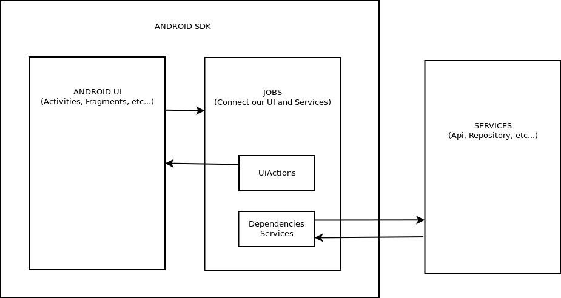

# Simple Scala Android Architecture

This is a simple architecture for Android project made in Scala using Cats and ScalaZ libraries

# Modules

- **android**: This module contains the Android SDK with Activities, Fragments and so on, used 
in your project. Every screen have _jobs_, with the actions in your UI and _Ui Actions_ 
(We speak about them later)

- **services**: This module contains services for connecting to out of the applications. For
example: API, Repository, Disk, so on

- **commons**: This module contains types and resources used in other module in order to compose 
the result of the methods

# Architecture

Our Activities, Fragment and other screen of Android call to action using _Jobs_. Jobs are a
group of methods that contain the things that the UI can do. For example: _loadItems_, 
_showItem_, _markAsDone_, etc

The principles of the Jobs is that they can connect to the UI (using _Ui Actions_) and api, repository
or whatever (using _Services_)



In order to can compose the methods of the Ui and Services, all methods must return the same type. 
The type is define in _commons_ module and it's the next:

_**type Service[Ex <: Throwable, Val] = XorT[Task, Ex, Val]**_

Our _Service_ type is a _Task_ of _ScalaZ_ in other to can do async tasks and using a _Xor_ of
_Cats_ for exceptions and value of the method

For example, a method of our Jobs can have calls to Ui and Services:
 
```
  def loadAnimals: Service[Throwable, Unit] = {
    for {
      _ <- uiActions.showLoading()
      animals <- apiService.getAnimals()
      _ <- uiActions.showContent()
      _ <- uiActions.loadAnimals(animals)
    } yield ()
  }
```

In the activity we can do that:

```
val tasks = (jobs.initialize |@| jobs.loadAnimals).tupled

tasks.value.resolveOr(_ => jobs.showError)
``` 
   
We can compose _initialize_ and _loadAnimals_ in a _Applicative_ and using _TaskOps_ (defined in _commons_ 
module) we can launch the async task and launch the error if the task doesn't work 